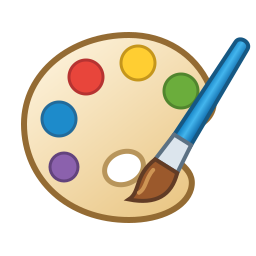

# Paint 10



A Rust drawing app inspired by Windows 10 Paint, with its familiar ribbon,
brushes, shapes, selections, and shortcuts. Paint 10 adds editable text and image
objects, arbitrary rotation, transparent canvases, pixel art tools, and a richer
color editor. The desktop and WebAssembly builds share the same drawing engine
and interface, built with egui/eframe.

**[Open Paint 10 in your browser](https://eiis1000.github.io/paint-10/)** ·
[Build status](https://github.com/eiis1000/paint-10/actions/workflows/build.yml)

Paint 10 is an independent project. Linux and the browser are manually tested;
CI builds and tests Linux, Windows, macOS, Nix, and WebAssembly.
See [platform status and limits](#platform-status-and-limits).

## Get started

Run these commands from a checkout of this repository.

### Linux with Nix

With Nix flakes enabled:

```sh
nix run path:.
# Or open an existing picture or Paint 10 project:
nix run path:. -- /path/to/picture.png
```

To build separately, use `nix build path:.` and then `./result/bin/paint-10`.
The flake supports `x86_64-linux` and `aarch64-linux`, with dependencies pinned
in `flake.lock`. Running the native app requires a graphical desktop and OpenGL.
NixOS and Home Manager installation is covered [below](#install-in-nixos-or-home-manager).

### In your browser

Use the [hosted app](https://eiis1000.github.io/paint-10/), or build and serve
the static site on Linux with the pinned Nix environment:

```sh
nix develop .#web -c bash scripts/build-web.sh
nix develop .#web -c python3 -m http.server 8080 --bind 127.0.0.1 --directory target/web
```

Open **http://127.0.0.1:8080/** while the server is running. Use a current desktop
browser with WebGL. The site processes pictures on your device; it does not
upload them to a server. `nix build .#paint-10-web` produces a packaged static site.

To publish on GitHub Pages, follow the [deployment guide](web/README.md#publish-with-github-pages).
The checked-in workflow deploys your default branch after all native, Nix, and
browser checks pass and Pages is configured to use **GitHub Actions**.
The [browser guide](web/README.md) also covers building
without Nix, font loading, downloads, and clipboard permissions.

### Linux, Windows, or macOS with Cargo

Install Rust and your platform's native build dependencies:

| Platform | Build prerequisites |
| --- | --- |
| Linux | C/C++ build tools, `pkg-config`, GTK 3, and X11/Wayland/OpenGL development libraries; see the [Ubuntu packages in CI](.github/workflows/build.yml) |
| Windows | Visual Studio C++ build tools and the Rust MSVC toolchain |
| macOS | Xcode Command Line Tools and Rust |

```sh
cargo build --locked --release
```

Run `target/release/paint-10` on Linux/macOS or `target/release/paint-10.exe` on
Windows. Pass an image or `.p10` path to open it. These are the default output
paths; `CARGO_TARGET_DIR` overrides `target/`.

For a distributable archive, run `python3 scripts/package-native.py` with Python
3.12 or newer (`python` on Windows). It produces a ZIP on Windows or a tar.gz on
Linux/macOS in the Cargo target directory. The macOS archive contains
**Paint 10.app**. Linux archives require the corresponding system libraries
at runtime.

## Drawing and editing

- **Paint tools:** Pencil, fill, eraser, eyedropper, magnifier, nine brushes, and
  all 23 Paint shapes, including polygons and two-bend curves. Shapes have
  adjustable drafts, textured outlines and fills, and optional linear/radial
  gradients. Press Enter to apply a finished shape.
- **Selections and images:** rectangle/free-form and transparent selections,
  cut/copy/paste, crop, resize, skew, flips, and arbitrary-angle rotation.
  Inserted images retain their source pixels through resizing and rotation.
  Source crops, brightness, contrast, saturation, warmth, hue, gamma, opacity,
  blur, sharpening, grayscale, and inversion remain reversible in projects.
- **Editable text:** mixed formatting, searchable font families, point sizes,
  bold, italic, underline, strikeout, alignment, colored outlines, and transparent
  or opaque backgrounds. Text supports shaped scripts, mixed writing directions,
  and Unicode selection and deletion.
- **Pixel art:** a 1-pixel Pencil, zoom up to 3200%, pixel grid, separate remembered
  tool widths, nearest-neighbor scaling, and transparent backgrounds.
- **Color tools:** Paint HSL, RGB, HSL, HSV, linear RGB, CMYK, OKLab, and OKLCH;
  visual coordinate planes, alpha, CSS color entry, gamut fitting, 48 basic
  colors, and 16 persistent custom colors.
- **Precision and output:** rulers, DPI-aware properties, distance measurements,
  a thumbnail navigator, image/project exports, page setup, tiled print preview,
  and PDF generation.

The Home ribbon contains drawing tools; View contains navigation and measurement
controls. Image groups transforms, cropping, color adjustments, and original
image recovery. Color 1 is the foreground and Color 2 is the background.
Right-click a palette swatch to set Color 2. Ribbon groups collapse into menus
at narrow widths. The title-bar dropdown customizes the Quick Access Toolbar.

**Captions and memes:** choose Text and drag a box. Format selected words
independently, or use a bold, centered caption with a contrasting outline over
a photograph. Drag the box border to move it and its handles to reflow it.
Ctrl+Enter finishes the box and keeps Text selected. Double-click a retained
text object to edit it again. Native builds discover installed fonts; browser
**Font list → Load font** imports TTF, OTF, and TTC files. Projects embed used
fonts so captions remain editable elsewhere. The live preview and exported
picture use the same text rendering.

**Pixel art:** use a 1-pixel Pencil, enable **View → Gridlines**, and zoom in.
**Transparent Color 2** lets clear, erase, and fill remove opacity. Select
**Keep hard pixel edges (pixel art)** in Resize for nearest-neighbor enlargement.

**Image editing:** select an inserted image, then use **Image → Adjust colors**
or **Crop image**. Preview edits before applying them; Cancel leaves the picture
untouched. Crop supports free dimensions and common aspect ratios. **Reset image**
restores the selected image's original pixels, dimensions, colors, and rotation;
Undo recovers the edits. Save as `.p10` to keep this source data. With no image
selected, adjustments create an editable image from the current canvas or pixel
selection. Thumbnail previews approximate full-resolution effects.

**Measurements:** enable **View → Measure distance** and drag between pixel
centers. Adjust either endpoint with the mouse or arrows (Shift: ten pixels).
The readout shows distance, horizontal/vertical displacement, and angle;
physical units use the image's DPI. Delete resets it, and Escape leaves the
tool. Measurements never appear in saved pictures.

**Color editing:** Space changes both the numeric fields and the visible
color plane; Slice selects its fixed axis where applicable. Color text accepts
hex, CSS names, `rgb()`, `hsl()`, `oklab()`, `oklch()`, and `color(srgb …)` /
`color(srgb-linear …)`. For example, `#66339980` is half-transparent purple.
RGB edits preserve alpha. The canvas is 8-bit sRGB; **Fit to sRGB** reduces
out-of-gamut chroma while preserving lightness and hue. CMYK is an unprofiled
selection approximation, not a print proof.

## Saving your work

**Use `.p10` for work you want to keep editing.** Standard image formats save
the visible pixels; reopening them gives a flattened picture.

| Format | Best use and behavior |
| --- | --- |
| Paint 10 project (`.p10`) | Retains editable text, embedded fonts, original image pixels, crops, adjustments, transforms, and canvas pixels |
| PNG | Lossless pictures and pixel art with full transparency |
| JPEG (`.jpg`, `.jpeg`, `.jpe`) | Photographs; lossy, with transparency composited over white |
| BMP (`.bmp`, `.dib`) | Monochrome, 16-color, 256-color, or 24-bit output; transparency composited over white |
| GIF | Indexed color with a transparent palette entry |
| TIFF | Raster pictures with full transparency |
| WebP | Lossless raster pictures with full transparency |
| ICO | Icon images with transparency |
| PDF | Printable pages using Page Setup, generated through the print/PDF commands |

**Save a copy** preserves the current filename and saved revision.
**Save selection as** exports only the selected pixels or object. Page Setup
provides paper presets and custom sizes, margins, orientation, centering,
actual-size scaling, and fitting across multiple pages.

Undo history is limited to the current session and is not stored in `.p10`.
New projects use format version 3 to preserve image edits. Paint 10 still opens
versions 1 and 2; older releases reject version 3 instead of losing those edits.
Raster operations such as lifting a pixel selection, adjusting a composite
selection, or erasing through objects can merge editable objects into pixels;
Undo restores them while that operation remains in history.

**In the browser, Save downloads a file.** It cannot automatically replace the
original or confirm that the download completed, so the picture stays marked
as modified. Before New/Open, check the downloaded file and then choose
**Don't save** in the pending prompt. Pictures are not automatically saved in
browser storage. See [browser file handling](web/README.md#files-text-and-clipboard).

## Keyboard shortcuts

| Action | Shortcut |
| --- | --- |
| New / Open / Save | Ctrl+N / Ctrl+O / Ctrl+S |
| Save as | F12 or Ctrl+Shift+S |
| Undo / Redo | Ctrl+Z / Ctrl+Y or Ctrl+Shift+Z |
| Cut / Copy / Paste | Ctrl+X / Ctrl+C / Ctrl+V |
| Paste from a file / Select all | Ctrl+Shift+V / Ctrl+A |
| Resize and skew / Image properties | Ctrl+W / Ctrl+E |
| Crop / Invert colors / Clear picture | Ctrl+Shift+X / Ctrl+Shift+I / Ctrl+Shift+N |
| Print | Ctrl+P |
| Gridlines / Rulers | Ctrl+G / Ctrl+R |
| Zoom | Ctrl+mouse wheel or Ctrl+PageUp / Ctrl+PageDown |
| Increase / decrease tool size | Ctrl+Plus / Ctrl+Minus |
| Bold / Italic / Underline in text | Ctrl+B / Ctrl+I / Ctrl+U |
| Finish text / Apply shape | Ctrl+Enter / Enter |
| Cancel or deselect / Picture view | Escape / F11 |
| Show ribbon keytips / Context menu | Alt or F10 / Shift+F10 |
| Cycle ribbon tabs / Focus canvas or ribbon | Ctrl+Tab / F6 |
| Collapse ribbon / Quick Access command | Ctrl+F1 / Alt+1, Alt+2, … |

On macOS, Command works for the corresponding document and text shortcuts.
Cmd+W/Q closes through the unsaved-work prompt; use physical Ctrl+W for Resize.
Browsers reserve some keys, such as Ctrl+N and Ctrl+PageUp/PageDown; use the
equivalent ribbon command. With the canvas focused, Ctrl+R toggles rulers;
F5 remains available to reload the page.

## Install in NixOS or Home Manager

Add Paint 10 as a flake input. A minimal NixOS example, using your existing
`configuration.nix`:

```nix
{
  inputs.nixpkgs.url = "github:NixOS/nixpkgs/nixos-unstable";
  inputs.paint10.url = "github:eiis1000/paint-10";

  outputs = inputs@{ nixpkgs, ... }: {
    nixosConfigurations.my-machine = nixpkgs.lib.nixosSystem {
      system = "x86_64-linux";
      modules = [
        ./configuration.nix
        ({ pkgs, ... }: {
          environment.systemPackages = [
            inputs.paint10.packages.${pkgs.stdenv.hostPlatform.system}.paint-10
          ];
        })
      ];
    };
  };
}
```

For a local checkout, use `inputs.paint10.url = "path:/absolute/path/to/paint"`.
For Home Manager, use the same package in `home.packages`; make `inputs`
available through your flake's surrounding scope or `extraSpecialArgs`:

```nix
home.packages = [
  inputs.paint10.packages.${pkgs.stdenv.hostPlatform.system}.paint-10
];
```

The flake also exports `overlays.default` to provide `pkgs.paint-10` using your
package set. Installation includes the runtime wrapper, desktop launcher, and
icon. It does not configure scanners, cameras, or desktop portal services.

## Development

The Nix shells supply Rust, native libraries, and Linux capture helpers.
The web shell additionally includes Node, Python, and WebAssembly build tools.

```sh
nix develop .#web -c cargo run
nix develop .#web -c cargo test --locked --all-targets
nix develop .#web -c cargo fmt --check
nix develop .#web -c cargo clippy --locked --all-targets -- -D warnings
nix develop .#web -c node web/browser-events.test.mjs
nix flake check
```

To keep disposable build artifacts under `/tmp` on Linux:

```sh
export CARGO_TARGET_DIR=/tmp/paint-10-target
nix develop .#web -c bash scripts/build-web.sh
nix develop .#web -c python3 -m http.server 8080 --bind 127.0.0.1 --directory "$CARGO_TARGET_DIR/web"
```

Cargo, the web builder, and native packaging honor that directory. Keep source,
projects, and anything that must survive a reboot elsewhere. Development builds
retain line information for backtraces, omit dependency debug information, and
disable incremental caches; variable-level debugging requires a debug profile
override. Release builds use link-time optimization and stripped symbols.

For manual testing on a private desktop:

```sh
nix develop .#test -c scripts/headless-desktop.sh
```

This creates an isolated Xvfb display, D-Bus session, and temporary user
directories under `/tmp`, and prints its display number and log location.
Pass a command after the script name to test an existing binary. GUI automation
should use that private display and session.

The [build workflow](.github/workflows/build.yml) runs native and browser checks
and packages native archives. [TESTING.md](TESTING.md) records actual verification;
[FEATURES.md](FEATURES.md) tracks coverage, and [PARITY_AUDIT.md](PARITY_AUDIT.md)
records differences from Windows Paint. Shared engine code lives in `src/`, the
GUI in `src/app/`, and the browser host in `web/`. Vector toolbar icons are in
`src/icons/`; [assets/paint-10.svg](assets/paint-10.svg) is the application icon.
Regenerate its native/browser assets with
`nix develop .#test -c bash scripts/build-icons.sh`.

## Platform status and limits

- **Linux:** built and manually tested locally on x86_64. Wayland and X11 are
  supported. The ARM Linux flake output evaluates but has not been built or run
  locally.
- **Windows and macOS:** native code and CI build/package jobs are present;
  execution on those systems has not been verified locally. Signing and
  notarization are not configured.
- **Browser:** uses the shared Rust drawing, editing, project, and export code.
  Clipboard access requires browser permission and HTTPS or localhost. Installed
  system fonts cannot be enumerated; local font imports are available instead.
- **Desktop integrations:** scanner/camera capture, email drafts, wallpaper, and
  system printing use Linux helpers or portals. Physical devices and host portal
  operations have not been exercised. Windows/macOS and browser printing generate
  PDFs for a viewer. Paint 10 never sends email itself.
- **Document limits:** 16 megapixels, at most 16,384 pixels on either axis,
  bounded undo memory, and up to 1,000 project objects / 128 MB of object data.
  Native windows require at least 500×400; smaller browser layouts need work.

Brush rendering, fonts, native dialogs, and some keyboard presentation differ
from Microsoft Paint. Complete behavioral or visual equivalence is not claimed.

## License

Paint 10 is [MIT licensed](LICENSE). Bundled fonts have their own
[redistribution notices](assets/fonts/DejaVu-LICENSE.txt); the vendored
[egui-winit patch](vendor/egui-winit/PAINT10-PATCH.md) retains its upstream licenses.
