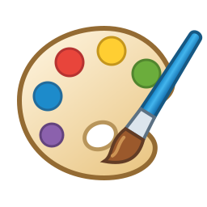

# Paint 10

Since switching to Linux full-time, there has been only one thing I've sorely missed about Windows:
MS Paint. So I asked Astra to recreate Windows-10-era MS Paint, from scratch, in Rust, cross-platform
— with some additional improvements that I've always wanted, of course. Astra's README is below.

---



Paint 10 is a free, open-source MS Paint alternative for Linux, Windows, macOS,
and the web. It recreates the Windows 10 ribbon interface and adds editable text,
layers, transparency, and dark mode. Built in Rust with egui/eframe.

**[Use Paint 10 online](https://eiis1000.github.io/paint-10/)** ·
[Build status](https://github.com/eiis1000/paint-10/actions/workflows/build.yml)

## Contents

- [Get started](#get-started)
  - [Cargo](#cargo)
  - [Browser](#browser)
  - [Nix](#nix)
- [Using Paint 10](#using-paint-10)
- [Saving](#saving)
- [Shortcuts](#shortcuts)
- [NixOS and Home Manager](#nixos-and-home-manager)
- [Development](#development)
- [Platform support and limits](#platform-support-and-limits)
- [Differences from Windows 10 Paint](#differences-from-windows-10-paint)
- [License](#license)

## Get started

### Cargo

Install Rust and the native build dependencies, then build from a checkout:

| Platform | Dependencies |
| --- | --- |
| Linux | C/C++ tools, `pkg-config`, GTK 3, X11/Wayland/OpenGL development libraries ([Ubuntu package list](.github/workflows/build.yml)) |
| Windows | Visual Studio C++ build tools and Rust's MSVC toolchain |
| macOS | Xcode Command Line Tools |

```sh
cargo build --locked --release
```

Run `target/release/paint-10` (`paint-10.exe` on Windows).
An optional image or `.p10` path opens that file.

To package it, run `python3 scripts/package-native.py` with Python 3.12+
(`python` on Windows). Archives go in the Cargo target directory; the macOS
archive includes **Paint 10.app**. Linux needs the runtime system libraries.

### Browser

**[Open Paint 10](https://eiis1000.github.io/paint-10/)** in a current desktop
browser with WebGL. No install or account needed. Files are processed locally,
with no uploads or analytics. Download your work before closing: pictures
aren't autosaved.

To build and serve locally on Linux:

```sh
nix develop .#web -c bash scripts/build-web.sh
nix develop .#web -c python3 -m http.server 8080 --bind 127.0.0.1 --directory target/web
```

Open http://127.0.0.1:8080/.
See the [browser guide](web/README.md) for builds without Nix and GitHub Pages deployment.

### Nix

With flakes enabled:

```sh
nix run github:eiis1000/paint-10#paint-10
```

From a checkout, use `nix run path:.` or `nix build path:.`.
Append `-- /path/to/picture.png` to either run command to open a file.
The flake targets `x86_64-linux` and `aarch64-linux`; the app needs a graphical
desktop and OpenGL. `nix build .#paint-10-web` builds the static website.

## Using Paint 10

- **Draw:** pencil, fill, eraser, eyedropper, nine brushes, and 23 shapes.
  Color 1 is the foreground; right-click a swatch to set Color 2.
- **Edit:** rectangular/free-form selections, crop, resize, skew, flips, and
  arbitrary rotation. Ctrl+W opens the combined transform dialog.
  Pasting or rotating an oversized image expands the canvas to fit.
- **Text:** drag a text box, format words, and press Ctrl+Enter to finish.
  Double-click it to edit again. **Text → LaTeX…** adds equations.
  In the browser, **Font list → Load font** imports TTF, OTF, or TTC files.
- **Layers:** enable **View → Layers** for ordering, visibility, locking,
  opacity, duplication, and merging. Edits affect the active layer.
- **Pixel art:** use a 1-pixel Pencil, **View → Gridlines**, and
  **Keep hard pixel edges** when resizing. Transparent Color 2 makes
  clear, erase, and fill remove opacity.
- **Navigate:** touchpad pinch or Ctrl+wheel zooms around the pointer
  (Command+wheel on macOS); ordinary scrolling pans. Zoom spans 12.5–3200%.
- **Appearance:** the **sun / Auto / moon** switch beside Help selects light,
  system, or dark mode. **View → Appearance → New canvas** chooses a matching
  or fixed background. This is the saved picture's actual background;
  changing themes doesn't recolor existing work. Preferences survive reloads.

## Saving

Use **`.p10`** to keep layers, editable text, embedded fonts, original images,
and reversible image adjustments. Image exports flatten the visible layers.

| Format | Notes |
| --- | --- |
| PNG, TIFF, WebP, ICO | Support transparency; WebP output is lossless |
| JPEG | Lossy; transparent areas become white |
| BMP | 1-, 4-, 8-, or 24-bit; transparent areas become white |
| GIF | Indexed color with a transparent palette entry |
| PDF | Page Setup and print commands; supports tiled pages |

**Save a copy** keeps the working filename. **Save selection as** exports the
selected pixels or object. Undo history lasts only for the current session.
Some raster edits and merges flatten editable objects; Undo can restore them.

Browser saves download a file and keep the unsaved-work indicator, because the
app cannot confirm the download finished. Before New/Open, check your download,
then choose **Don't save**. See [browser file handling](web/README.md#files-text-and-clipboard).

## Shortcuts

| Action | Shortcut |
| --- | --- |
| New / Open / Save | Ctrl+N / Ctrl+O / Ctrl+S |
| Save as | F12 or Ctrl+Shift+S |
| Undo / Redo | Ctrl+Z / Ctrl+Y or Ctrl+Shift+Z |
| Cut / Copy / Paste | Ctrl+X / Ctrl+C / Ctrl+V |
| Paste from file / Select all | Ctrl+Shift+V / Ctrl+A |
| Resize, skew, rotate / Properties | Ctrl+W / Ctrl+E |
| Crop / Invert / Clear picture | Ctrl+Shift+X / Ctrl+Shift+I / Ctrl+Shift+N |
| Print | Ctrl+P |
| Gridlines / Rulers | Ctrl+G / Ctrl+R |
| Zoom | Ctrl+wheel or Ctrl+PageUp / PageDown |
| Increase / decrease tool size | Ctrl+Plus / Ctrl+Minus |
| Bold / Italic / Underline | Ctrl+B / Ctrl+I / Ctrl+U |
| Finish text / Apply shape | Ctrl+Enter / Enter |
| Cancel / Picture view | Escape / F11 |
| Ribbon keytips / Context menu | Alt or F10 / Shift+F10 |
| Cycle tabs / Focus canvas or ribbon | Ctrl+Tab / F6 |
| Collapse ribbon / Quick Access | Ctrl+F1 / Alt+1, Alt+2, … |

On macOS, Command works for document and text shortcuts; use physical Ctrl+W
for Resize. Browsers reserve some shortcuts, so use ribbon commands when needed.
With the canvas focused, Ctrl+R toggles rulers; F5 reloads the page.

## NixOS and Home Manager

Add the flake input:

```nix
inputs.paint10.url = "github:eiis1000/paint-10";
```

Then add the package to your NixOS configuration:

```nix
environment.systemPackages = [
  inputs.paint10.packages.${pkgs.stdenv.hostPlatform.system}.paint-10
];
```

For Home Manager, use `home.packages` instead. Pass `inputs` through
`specialArgs` / `extraSpecialArgs`, or use the enclosing flake scope.
The flake also exports `overlays.default` for `pkgs.paint-10`.
Installation includes a desktop launcher and icon.

## Development

```sh
nix develop .#web -c cargo run
nix develop .#web -c cargo test --locked --all-targets
nix develop .#web -c cargo fmt --check
nix develop .#web -c cargo clippy --locked --all-targets -- -D warnings
nix develop .#web -c node web/browser-events.test.mjs
nix flake check
```

Set `CARGO_TARGET_DIR` to relocate Cargo, web, and packaging output.
Nix builds use Crane to cache compiled dependencies; CI retains that cache.
For GUI testing on an isolated Xvfb desktop:

```sh
nix develop .#test -c scripts/headless-desktop.sh
```

Engine code is in `src/`, the GUI in `src/app/`, and the browser host in `web/`.
See [TESTING.md](TESTING.md) for verification, [FEATURES.md](FEATURES.md) for
coverage, and [PARITY_AUDIT.md](PARITY_AUDIT.md) for the detailed Paint comparison.
Regenerate icons with `nix develop .#test -c bash scripts/build-icons.sh`.

## Platform support and limits

- Linux x86_64 and the browser are manually tested. CI builds/tests Linux,
  Windows, macOS, Nix, and WebAssembly. Windows/macOS haven't been run locally;
  signing/notarization aren't configured. ARM Linux has only been evaluated locally.
- Browser clipboard access needs permission and HTTPS or localhost.
  Import fonts instead of using installed system fonts.
- Scanner/camera, email drafts, wallpaper, and system printing use Linux
  helpers or portals; hardware integration hasn't been verified.
  Other platforms print through PDF.
- Maximum canvas: 16 megapixels and 16,384 pixels per axis. Projects allow
  1,000 objects, 128 MB of object data, and 64 layers within a combined
  192 MiB layer/asset budget. Undo memory is bounded.
- Native windows need at least 500×400; small browser layouts need work.

## Differences from Windows 10 Paint

| Area | Paint 10 additions or differences |
| --- | --- |
| Appearance | Saved light, dark, and system themes; theme-aware canvas defaults |
| Text | Reopenable boxes, mixed formatting, alignment, strikeout, caption outlines, LaTeX equations |
| Images | Retained originals, reversible crops and adjustments, arbitrary rotation, canvas growth on rotation |
| Layers | Optional layers with visibility, locking, opacity, and merging |
| Transparency | Full alpha in the canvas, colors, and supported exports |
| Colors | HSV, linear RGB, approximate CMYK, OKLab/OKLCH, CSS input, alpha, gamut fitting |
| Precision | Gradient fills, remembered tool widths, 3200% zoom, nearest-neighbor scaling, distance/angle measurement |
| Files | Editable `.p10` projects; WebP, ICO, and PDF exports |
| Interface | Evenly spaced ribbon tabs with an active underline, Image ribbon, extra Text controls, collapsible groups |
| Rendering | Brush textures, fonts, dialogs, and keytips differ from Microsoft's implementation |
| Platforms | Desktop and browser; file handling, fonts, and system integration vary by platform |

## License

[MIT](LICENSE). Bundled [DejaVu fonts](assets/fonts/DejaVu-LICENSE.txt),
[RaTeX](assets/licenses/RaTeX-LICENSE.txt),
[KaTeX fonts](assets/licenses/KaTeX-fonts-NOTICE.txt), and the
[egui-winit patch](vendor/egui-winit/PAINT10-PATCH.md) retain their own notices.
